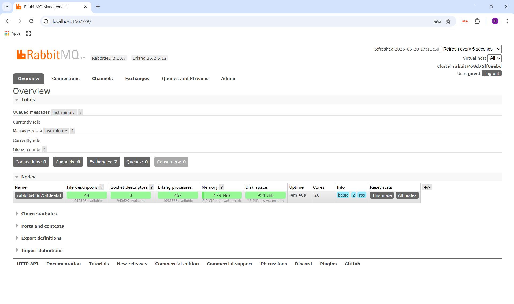
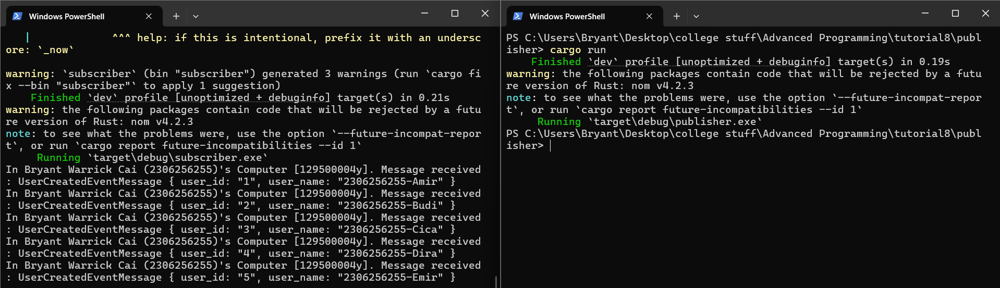
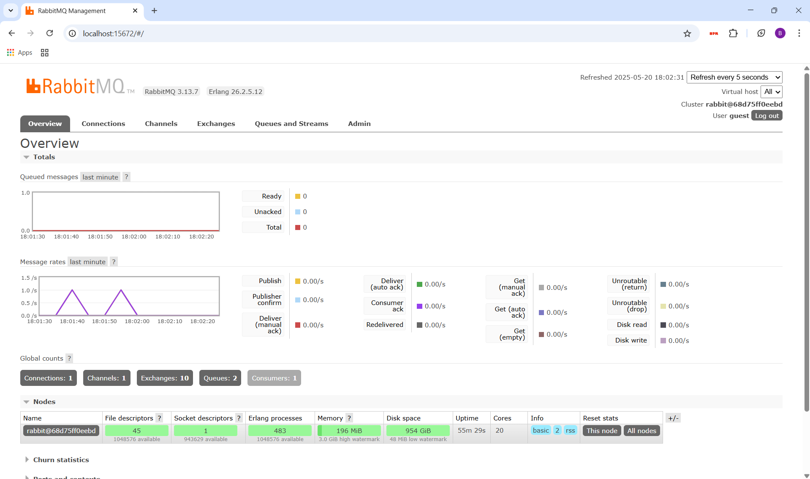

# Module 9 - Publisher
## Question 7
a.  
Borsh serializes each string as a 4-byte length prefix (string length as unsigned 32-bit integer). For `user_id`, since each string is only 1 byte long, the total length for `user_id` would be 4 + 1 = 5 bytes.

For `user_name`, each username has 15 bytes, so adding it by the 4-byte length prefix gives 19 bytes in total.

Therefore, each message has a total size of 5 + 19 = 24 bytes.

Since there are five messages in total, the number of bytes is 24 * 5 = 120 bytes.

b.  
When the same URL is used on both the publisher and subscriber, it essentially connects to the same AMQP broker. By connecting to the same broker, they can exchange messages from the same queues, enabling the exchange of data.

## RabbitMQ initial screenshot

## RabbitMQ Terminal screenshot

When you run `cargo run` on the publisher app, the app sends five messages to the message broker. These messages are then received and processed by the subscriber.

## RabbitMQ screenshot when running `publisher` twice

When you run the publisher app and the app sends five messages to the broker, the message rates increase. In this screenshot, I ran the publisher app twice, each one sending five messages. The peaks show the times when I run the publisher app and the messages are sent.
